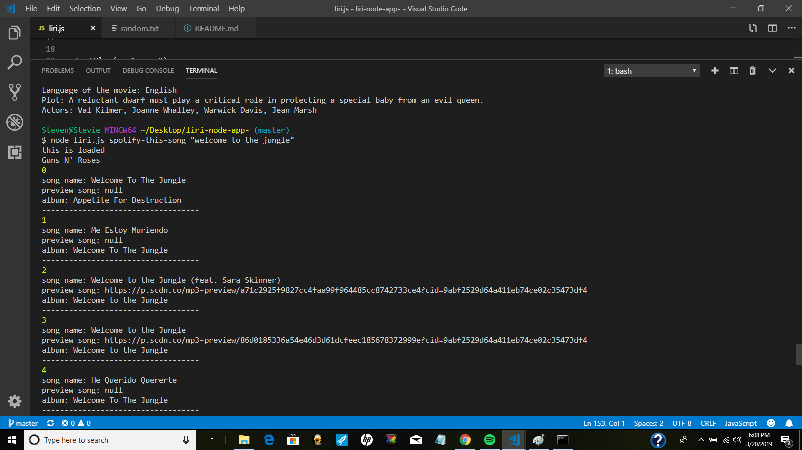
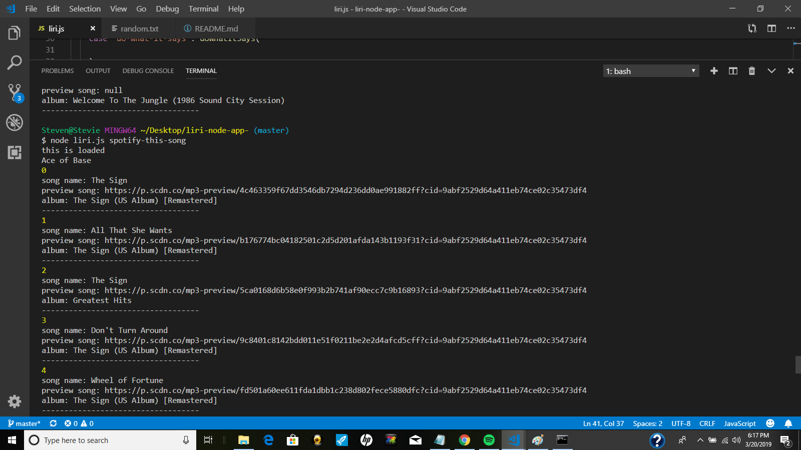
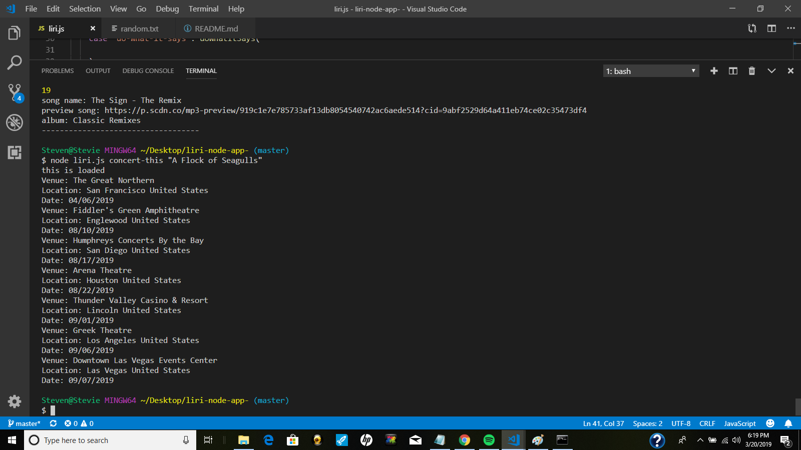
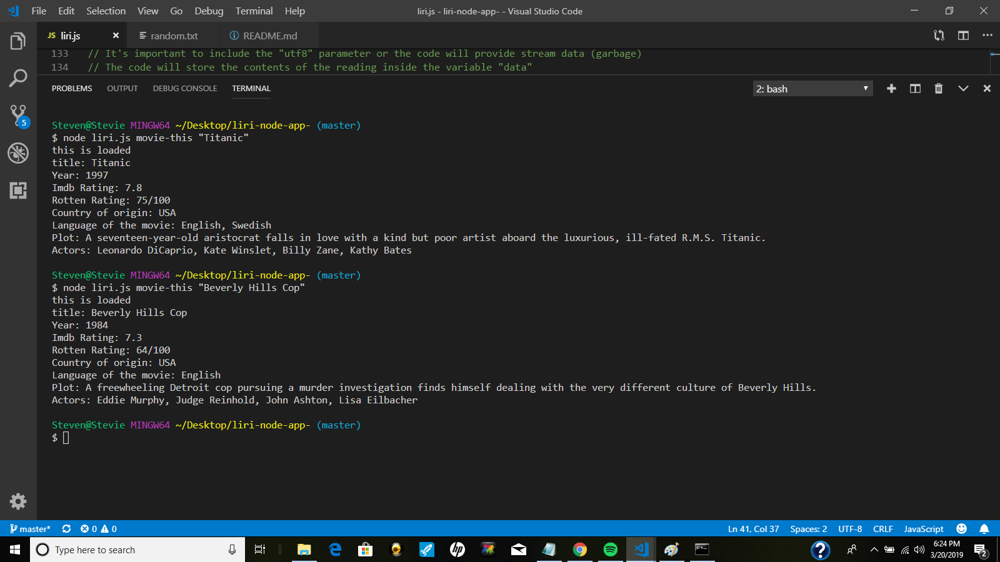
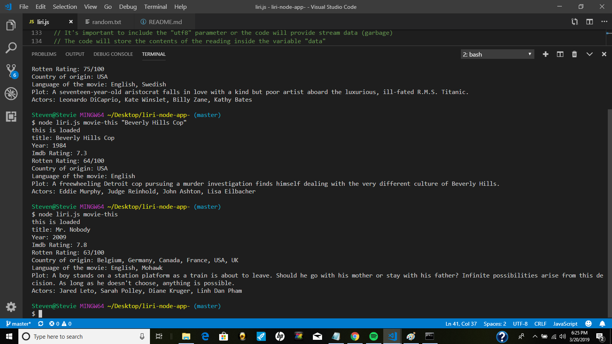
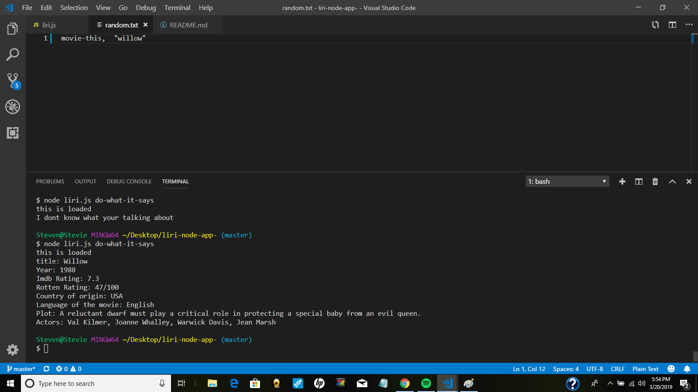

# liri-node-app-

 LIRI is a Language Interpretation and Recognition Interface. LIRI will be a command line node app that takes in parameters and gives you back data using Node.JS in the terminal. There are only four commands that can be used in the terminal:

spotify-this-song 

concert-this

movie-this

do-what-it-says

# To use the Spotify API with Node.JS, we show the following information about a song in the terminal.

* Artist(s),
* The song's name,
* A preview link of the song from Spotify, and
* the album that the song is from.

We type:

node liri.js spotify-this-song "song name here"

If no song is provided then the program will default to "The Sign" by Ace of Base.
This instance would be:

node liri.js spotify-this-song

# The second command uses the "Bands in Town" API with   the axios package to fetch html information and display it in the console. It displays:

* Name of the venue
* Venue location
* Date of the Event ( in format "MM/DD/YYYY") 

To use this API we type:

node liri.js concert-this "name of band"

*The date format uses the Moment package. 

#  The third API uses OMDB information for a movie and displays information.  

  * Title of the movie.
   * Year the movie came out.
   * IMDB Rating of the movie.
   * Rotten Tomatoes Rating of the movie.
   * Country where the movie was produced.
   * Language of the movie.
   * Plot of the movie.
   * Actors in the movie.

To use this API we type:

node liri.js movie-this "name of movie"

If no movie is selected then the default information is for 
"Mr Nobody." This instance the user would type

node liri.js movie-this 

# The final command uses the Node FS (File System Module) package.

 Typing:

 node liri.js do-what-it-says
 
 If this is typed into the terminal, then information will be read in the random.txt file. This will ouput the command that is inside the text file and run it in the terminal.  Currently I am referenecing the "movie-this" command and a name of a movie "Willow."  I could put "spotify-this-song" and a name of a song, or "concert-this" and a name of a band, or choose a different movie with "movie-this." 

